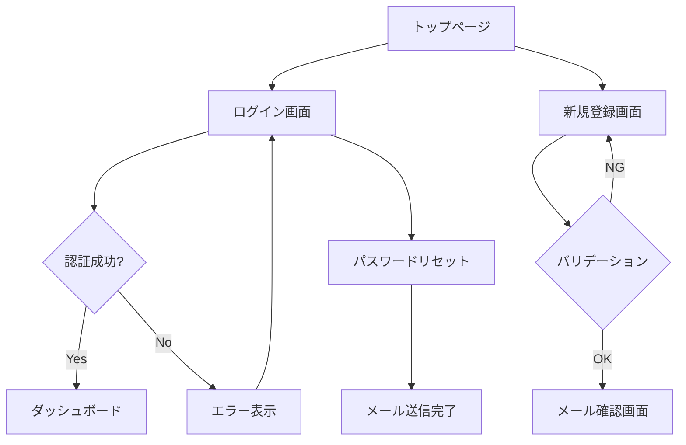

# Magi — 最終開発計画

## 3人の賢者が議論し、コードを織り上げる

---

## 名前の由来

**Magi** — 東方三博士。異なる知恵を持つ3人の賢者が集い、
それぞれの贈り物を持ち寄る。

PM（ビジネスの知恵）、PD（ユーザーの知恵）、Dev（技術の知恵）。
3つの異なる視点が合議し、1つの優れた成果物を生み出す。

---

## コンセプト

Magiには2つのモードがある。

### Specモード（仕様駆動）— PM/PD向け

```
$ magi spec "ユーザー認証機能を追加したい"

  PM:  スコープ判断、MVP定義、ビジネス優先度
  PD:  UXフロー、エラー体験、アクセシビリティ
  Dev: 技術選定、セキュリティ、実現可能性

  → 議論 → 合意
  → 仕様書 + ADR（設計判断記録）+ タスクリスト を生成
  → Git push + GitHub Projects にタスク連携
  → 実装は人間でもAIでも誰がやってもいい
```

### Buildモード（実装駆動）— エンジニア向け

```
$ magi build "ユーザー認証機能を実装して"

  PM:  スコープ判断、MVP定義、ビジネス優先度
  PD:  UXフロー、エラー体験、アクセシビリティ
  Dev: 技術選定、セキュリティ、保守性

  → 議論 → 合意 → 実装 → レビュー → 検証 → 完了
  → 全過程がGitに残る
```

課題を投げたら、あとは見ているだけ。
3人の賢者が議論し、合意し、成果物を生み出す。
なぜその設計にしたか、却下した代替案は何か、全てが記録される。

Specモードで仕様を固め、Buildモードで実装する——という連携も可能。
あるいはSpecモードだけ使い、実装はClaude CodeやCursorに任せてもいい。

---

## 本質的な価値

1つのLLMに「コードを書いて」と頼むのとは根本的に違う。

| 従来のAIコーディング | Magi |
|-------------------|------|
| 1つの視点で即座に回答 | 3つの視点で議論してから実行 |
| なぜそう作ったか不明 | 議論の経緯がGitに残る |
| 見落としは自己責任 | 3ロールが相互チェック |
| 設計判断の記録なし | 採用/却下理由が検索可能 |

### 2つのモードが生む価値

| Specモード | Buildモード |
|-----------|------------|
| PM/PDが主な利用者 | エンジニアが主な利用者 |
| 成果物: 仕様書 + ADR + タスクリスト | 成果物: 動くコード |
| 実装は人間 or 他のAIツール | 議論から実装まで一気通貫 |
| 非エンジニアだけで使える | LSP + コード編集が必要 |
| 「何を作るか」を決める | 「どう作るか」まで実行する |

---

## アーキテクチャ

```
┌─────────────────────────────────────────────────────┐
│               Magi Server (常駐デーモン)               │
│                                                      │
│  ┌────────────────────────────────────────────────┐  │
│  │                Magi Core                        │  │
│  │                                                 │  │
│  │  Role Engine     PM/PD/Dev の議論進行            │  │
│  │  Context Mgr     永続コンテキスト + 過去議論参照  │  │
│  │  Pipeline        Analysis→Design→...→Verify     │  │
│  │  Intelligence    LSP Bridge + Symbol Index       │  │
│  │  Git             Auto-commit + Branch + Log      │  │
│  │  Logger          議論ログのMarkdown生成           │  │
│  └─────────────────────┬──────────────────────────┘  │
│                        │                             │
│  ┌─────────────────────▼──────────────────────────┐  │
│  │           REST API + WebSocket                  │  │
│  └──────────┬────────────────────┬────────────────┘  │
└─────────────┼────────────────────┼────────────────────┘
              │                    │
     ┌────────▼───────┐  ┌────────▼────────┐
     │   CLI Client    │  │   Web UI         │
     │   magi "..."    │  │   localhost:3400  │
     └────────────────┘  └─────────────────┘
```

### 技術スタック

| レイヤー | 技術 |
|---------|------|
| Core | TypeScript |
| LLM | Anthropic SDK (Claude) |
| API Server | Hono |
| Web UI | Next.js + Tailwind |
| CLI | Commander.js |
| LSP | vscode-languageserver-protocol |
| Build | tsup + Turborepo (pnpm monorepo) |

---

## チーム共有

### エンジニア: ローカルで実行、Web UIをポート共有

```
エンジニアのマシン
  Magi Server (localhost:3400)
       │
    VS Code Port Forwarding
       │
  ┌────┼────────┐
  PM   PD       他のDev
  ブラウザのみ   ブラウザ or CLI
  課題投入      全機能
  議論閲覧
  介入
```

VS Codeのポート転送を使えば、Magi側の実装変更なしで
チームメンバーにWeb UIを共有できる。
リアルタイムの議論閲覧・課題投入・介入が可能。

### 非エンジニア（PM/PD）向け: Web UIオンボーディング

共有されたURLを開いた非エンジニアには、シンプルなオンボーディングを表示:

```
┌──────────────────────────────────────┐
│  ようこそ Magi へ                     │
│                                      │
│  名前: [田中          ]               │
│  ロール: [PM ▾]                       │
│                                      │
│  [始める]                             │
└──────────────────────────────────────┘
```

名前とロールだけ入力すれば、議論の閲覧・投入・介入が可能。
CLI・Git・APIキーの設定は一切不要。
介入時は「田中 PM: ソーシャルログインも必要」と表示され、
人間の発言とAIロールの発言が区別できる。

### 過去の議論の共有: magi publish（静的サイト生成）

サーバーが動いていなくても、PM/PDが過去の議論を閲覧できる仕組み:

```
$ magi publish

  .magi/discussions/ の全議論ログを読み込み
       │
       ▼
  .magi/site/                ← 静的HTML生成
    ├── index.html            ← 議論一覧 + 検索
    ├── auth/index.html       ← 個別の議論ページ
    └── assets/               ← CSS/JS

  → GitHub Pages / Vercel / Netlify にデプロイ
  → URLを開くだけで誰でも閲覧可能
  → サーバー不要、ホスティング無料
```

Next.js の Static Export (output: 'export') を使い、
Web UIのコンポーネントをそのまま流用して静的HTMLに変換する。
git push のたびに CI/CD で自動ビルド・デプロイすれば
PM/PDは常に最新の議論をブラウザで確認できる。

静的サイトに含まれる情報:
- 全議論の一覧（日付・タスク名・コスト）
- 各議論の全文（ラウンドごとの発言、合意テーブル）
- 設計判断の検索（キーワードで採用/却下理由を検索）
- 議論間のリンク（派生元の議論への参照）
- Mermaidフロー図のレンダリング表示
- HTMLプロトタイプのプレビュー・操作

---

## コンテキスト管理

AIロールが的確な議論をするには、人間と同程度のコンテキストが必要。
Magiは2つの仕組みでコンテキストを提供する。

### 永続コンテキスト（.magi/context/）

プロジェクト全体に関わる情報を置いておく場所。
議論開始時にMagiが自動で読み込み、各ロールに渡す。

```
.magi/context/
  ├── product.md          ← プロダクト概要、ミッション、ターゲットユーザー
  ├── competitors.md      ← 競合分析、差別化ポイント
  ├── tech-stack.md       ← 採用技術、規約、制約
  ├── design-system.md    ← デザイン原則、UIパターン、トンマナ
  └── glossary.md         ← ドメイン用語の定義
```

ロールごとに関連情報を優先的に参照:

```yaml
# 自動マッピング（設定でカスタマイズ可能）
PM:  [product.md, competitors.md, glossary.md]
PD:  [product.md, design-system.md, glossary.md]
Dev: [tech-stack.md, glossary.md]
```

このファイルはチームの誰でも編集できる普通のMarkdown。
PMが競合調査を更新したり、PDがデザインシステムを追加すれば、
次のMagi議論から自動的に反映される。

### 過去の議論の自動参照

新しい課題を議論する際、関連する過去の議論・ADR・仕様書を
自動で検出してコンテキストに含める。

```
magi spec "決済機能を追加したい"
  │
  │  自動検出:
  │    ├── 過去の議論 "認証機能" → 認証方式の決定が関連
  │    ├── ADR-001 "JWT + httpOnly cookie" → セッション管理に影響
  │    └── 仕様書 "認証" → APIエンドポイントの設計に影響
  │
  │  → これらをコンテキストとして議論に含める
  │  → 「前回の認証ではhttpOnly cookieを採用した。
  │      決済のCSRFトークンも同じ方式で統一すべきか？」
  │      という議論が自然に生まれる
```

検出方法:
- タスクの説明文と過去の議論ログのキーワードマッチ
- .magi/specs/ と .magi/discussions/ を全文検索
- 関連度の高い上位3-5件をコンテキストに含める

### 将来のコンテキスト拡張（MVP後）

```
v1.1  タスク投入時の添付（--context オプション、Web UIドラッグ&ドロップ）
v1.2  自律リサーチ（Researchステージで Web検索、ドキュメント取得）
v2.0  外部ナレッジ連携（Notion、Confluence、Google Docs等）
```

---

## デザインの視覚化

PDの意図を言葉だけでなく視覚的に伝えるため、
議論の合意後に2種類の成果物を自動生成する。

### Mermaidダイアグラム — フローの全体像

議論で合意したユーザーフローや画面遷移を図として生成。
Markdown内に埋め込まれるので、GitHub・Magi Web UI・静的サイトの
いずれでもレンダリングされる。



仕様書(spec.md)と議論ログ(discussion.md)の両方に埋め込まれる。

### HTMLプロトタイプ — 具体的な画面

合意した画面設計を、操作可能なHTMLとして生成。
Tailwind CSSでスタイリングされた単一HTMLファイル。

```
prototypes/
  ├── login.html           ← ログイン画面
  ├── register.html        ← 新規登録画面
  └── reset-password.html  ← パスワードリセット

各HTMLに含まれるもの:
  - レイアウトとコンポーネント配置
  - エラー状態の表示（PDが議論で指摘した内容を反映）
  - レスポンシブ対応（モバイル/デスクトップ）
  - インタラクション（フォーム入力、バリデーション表示）
```

Web UIではiframeでプレビュー表示。
静的サイト(magi publish)にもプロトタイプが含まれ、
PM/PDがブラウザで直接操作して確認できる。

### 生成タイミング

```
議論中:   テキストのみ（トークン節約）
合意後:   Mermaid図 + HTMLプロトタイプを一括生成
         → UI関連の議論がない場合は生成しない（自動判定）
```

---

## 3つのロール

### PM — ビジネスの知恵

```
- MVPのスコープ判断（やらないことを決める）
- ビジネス優先度とリリース戦略
- 過剰な技術投資の抑制
- 「本当にそれ必要？」という問い
```

### PD — ユーザーの知恵

```
- UXフローの直感性
- エラー時・例外時の体験
- アクセシビリティ
- 「開発しやすい」と「使いやすい」は違う
```

### Dev — 技術の知恵

```
- 技術選定とアーキテクチャ
- セキュリティ、パフォーマンス
- テスト容易性と保守性
- 既存コードとの整合
```

ロール定義は `.magi/roles/*.yaml` でカスタマイズ可能。
Security、Architect 等の追加ロールも自由に定義できる。

---

## 自律実行パイプライン

### Specモードのパイプライン（AIDLC Inception対応）

AI-DLCのInceptionフェーズと仕様駆動開発(SDD)を統合。
AIDLCでは「AIが質問し、人間チームが回答する」が基本だが、
Magiではこのサイクルを「AIロール同士の議論」で高速に回す。

```
magi spec "ユーザー認証機能を追加したい"
  │
  │  ┌─────────────────────────────────────────────────┐
  │  │ Magiのコアサイクル（各ステージで繰り返す）         │
  │  │                                                  │
  │  │  Orchestrator が論点を提示                        │
  │  │       ↓                                          │
  │  │  PM/PD/Dev（AIロール）が各視点から回答・議論       │
  │  │       ↓                                          │
  │  │  合意形成 → 成果物を生成                           │
  │  │                                                  │
  │  │  ※ 人間はフェーズ間ゲートで承認                    │
  │  │  ※ 人間は議論中いつでも介入可能                    │
  │  └─────────────────────────────────────────────────┘
  │
  ├─ 1. Elaborate（Mob Elaboration）
  │    PM/PD/Dev のAIロールが課題を議論。
  │    Orchestratorが論点を整理し、各ロールが視点から回答。
  │    ビジネスインテント → 要件・ユーザーストーリーに分解。
  │    → requirements.md
  │
  ├─ 2. Specify（仕様策定）
  │    合意した要件から機能仕様書を生成。
  │    画面仕様、API仕様、データモデルを含む。
  │    PDの意図はMermaidフロー図 + HTMLプロトタイプで視覚化。
  │    → spec.md + flow.mermaid + prototypes/
  │
  ├─ 3. Decide（設計判断）
  │    技術選定、アーキテクチャ判断をADRとして記録。
  │    「何を選んだか」だけでなく「何を却下したか、なぜか」も残す。
  │    → adr-001.md, adr-002.md, ...
  │
  ├─ 4. Plan（タスク分割）
  │    仕様をタスクリストに分割。
  │    各タスクに見積り、依存関係、優先度、担当ロールを付与。
  │    タスクはユーザーストーリーにトレーサブル（追跡可能）。
  │    → tasks.yaml
  │
  └─ 5. Sync（連携・承認）
       Git push + GitHub Projectsにタスク作成。
       全成果物をdocs/配下にも配置（チームレビュー可能）。
       → 人間の最終承認を待ってから完了。

  成果物:
    .magi/specs/2026-03-14_auth/
      ├── requirements.md        ← 要件定義（ストーリー、受入基準）
      ├── spec.md                ← 機能仕様書（画面、API、データモデル）
      ├── adr-001-jwt-cookie.md  ← 設計判断記録
      ├── tasks.yaml             ← タスクリスト（トレーサビリティ付き）
      ├── flow.mermaid           ← 画面遷移・ユーザーフロー図
      ├── discussion.md          ← 議論ログ（全ラウンド）
      └── prototypes/            ← HTMLプロトタイプ
            ├── login.html
            └── reset-password.html

  Git:
    docs/specs/auth.md           ← 仕様書
    docs/adr/001-jwt-cookie.md   ← ADR
    docs/requirements/auth.md    ← 要件定義

  GitHub Projects:
    [ ] 認証: AuthStrategy インターフェース定義  (Dev, 1h)  ← Story #1
    [ ] 認証: EmailAuthStrategy 実装           (Dev, 2h)  ← Story #1
    [ ] 認証: パスワード強度メーター             (PD→Dev, 1h)  ← Story #2
    [ ] 認証: パスワードリセットフロー            (Dev, 2h)  ← Story #3
    [ ] 認証: 結合テスト                        (Dev, 1h)  ← Story #1-3
```

### Buildモードのパイプライン（AIDLC Construction対応）

AI-DLCのConstructionフェーズに対応。
Inceptionの成果物（仕様書、ADR、タスク）をコンテキストとして使い、
各ステージでAIDLCのコアサイクル（計画→質問→承認→実行）を回す。

```
magi build "認証機能を実装して"
  │
  ├─ 1. Analysis（コンテキスト構築）
  │    LSPでプロジェクト解析、影響範囲特定。
  │    既存コードのセマンティックコンテキストを構築。
  │    ブラウンフィールド（既存PJ）の場合、既存の規約や
  │    パターンを自動検出して尊重する。
  │    → analysis.md
  │
  ├─ 2. Design（Mob Construction — 設計）
  │    PM/PD/Dev が設計議論。
  │    Specモードの仕様書がある場合はそれをベースに議論。
  │    ない場合はこのステージで設計を決定。
  │    → design: commit + 01-design.md
  │
  ├─ 3. Implement（コード生成）
  │    タスクリストに沿って順次実装。
  │    各タスクの完了後にセルフレビュー。
  │    ストーリーへのトレーサビリティをcommitメッセージに含む。
  │    → feat: commits
  │
  ├─ 4. Review（品質検証）
  │    PM: 要件充足確認、PD: UXレビュー、Dev: コードレビュー。
  │    問題があればImplementに戻る。
  │    → fix: / refactor: commits
  │
  └─ 5. Verify（テスト・検証）
       テスト生成・実行、lint、ビルド確認。
       失敗をコード変更と相関させ、修正を提案。
       → test: commits

  完了: サマリー表示、議論ログ保存
```

### Spec → Build の連携（Inception → Construction）

```
AIDLC の Inception → Construction の流れをMagiで実現:

1. PM/PDが Specモードで仕様を策定（= Inception）
   $ magi spec "決済機能を追加したい"
   → 要件定義 + 仕様書 + ADR + タスクリスト が生成される
   → 各ステージで人間が承認してから次へ進む

2. エンジニアが Buildモードでタスクを実装（= Construction）
   $ magi build --spec .magi/specs/2026-03-14_payment/
   → Inception の全コンテキストを読み込み
   → タスクを順に実装（コンテキストが豊富なので精度が高い）

   または:
   - 人間が手で実装（仕様書とタスクリストを参照）
   - Claude Code / Cursor 等に仕様書を渡して実装
   - GitHub Copilot がタスクを見て実装

3. 将来: Operationsフェーズ
   → IaC生成、デプロイ設定、監視設定（v2.0以降）
```

### AIDLC の原則をMagiに組み込む

```yaml
# Magiが遵守するAIDLCの原則

human_oversight:
  - フェーズの区切りで人間の承認を求める（フェーズ間ゲート）
  - ステージ内はAIが自律的に進行（速度を維持）
  - 異常検出時（合意不成立、セキュリティ問題等）は即座に停止
  - AIは計画を提示し、人間が承認する（逆ではない）

context_accumulation:
  - 各ステージの成果物が次のステージのコンテキストになる
  - Inception → Construction でコンテキストがリッチになる
  - 全てのコンテキストがリポジトリに永続化される

traceability:
  - 要件 → ストーリー → タスク → コミット が追跡可能
  - 「なぜこのコードが存在するか」をビジネス要件まで遡れる
  - ADRで設計判断の理由と却下案が記録される

documentation_first:
  - ドキュメント（仕様書、ADR、要件）はコードより先に生成
  - .magi/ に全成果物が保存（コードが消えても記録は残る）
  - docs/ 配下にもチーム向けドキュメントを配置

mob_collaboration:
  - PM/PD/Dev の3つのAIロールが全ステージで議論
  - 「Mob Elaboration」= AIロール全員で要件を精緻化
  - 「Mob Construction」= AIロール全員で設計・実装を検証
  - 人間はフェーズ間ゲートで承認、議論中はいつでも介入可能
  - AIロール同士の議論で高速にサイクルを回しつつ、
    人間が要所で方向性を制御する
```

デフォルトはフェーズ間ゲート方式。
ステージ内は自動で進行し、フェーズの区切りで人間の承認を求める。

```
Specモード:
  Elaborate → Specify → Decide → Plan  ← ステージ内は自動
                                    ↓
                              [承認ゲート]  ← 人間が成果物を確認
                                    ↓
                                  Sync     ← 承認後にGit push + タスク連携

Buildモード:
  Analysis → Design                 ← ステージ内は自動
                 ↓
           [承認ゲート]              ← 人間が設計を確認
                 ↓
  Implement → Review → Verify       ← ステージ内は自動
```

ゲートで承認を求める理由:
- Specモード: 仕様とタスクを外部に連携する前に最終確認
- Buildモード: コードを書き始める前に設計の方向性を確認

ゲートに加え、以下の異常時は自動停止:

```yaml
# .magi/config.yaml
pipeline:
  # ゲート設定（デフォルト: フェーズ間で承認）
  gates:
    spec_before_sync: true       # Specモード: Sync前に承認
    build_before_implement: true  # Buildモード: 実装開始前に承認

  # 異常時の自動停止（ゲートとは別に常に有効）
  auto_pause:
    - when: design_disagreement    # ロール間で合意できない
    - when: security_issue_found   # セキュリティ問題を検出
    - when: breaking_change        # 破壊的変更が必要
    - when: cost_exceeds_threshold # コスト超過
      threshold: "$0.50"
```

---

## Git統合

全てがGitに残る。

```
git log --oneline
  a3f8e1c  design: email auth with strategy pattern
  b2c4d5e  feat: implement AuthStrategy interface
  c6d7e8f  feat: implement EmailAuthStrategy
  d9e0f1a  fix: password strength validation
  e2f3a4b  test: add auth integration tests

# Specモードの成果物
docs/
  ├── requirements/auth.md        ← 要件定義
  ├── specs/auth.md               ← 仕様書
  └── adr/001-jwt-cookie.md       ← 設計判断記録（ADR）

# 議論ログ（両モード共通）
.magi/discussions/2026-03-14_auth/
  ├── meta.yaml          ← コスト、判断理由、却下案
  ├── 00-analysis.md     ← 影響範囲
  ├── 01-design.md       ← PM/PD/Dev の設計議論
  ├── 02-implement.md    ← 実装時の判断（Buildモードのみ）
  ├── 03-review.md       ← レビュー議論（Buildモードのみ）
  └── summary.md         ← 自動サマリー

# Specモード固有（AIDLC Inception成果物）
.magi/specs/2026-03-14_auth/
  ├── requirements.md    ← 要件定義（ストーリー、受入基準）
  ├── spec.md            ← 機能仕様書（画面、API、データモデル）
  ├── adr-001.md         ← ADR（判断理由 + 却下案）
  ├── tasks.yaml         ← タスクリスト（ストーリーへのトレーサビリティ付き）
  ├── flow.mermaid       ← 画面遷移・ユーザーフロー図
  ├── discussion.md      ← 議論ログ（Mob Elaboration記録）
  └── prototypes/        ← HTMLプロトタイプ（PDの意図を視覚化）
        ├── login.html
        └── reset-password.html
```

### 振り返りコマンド

```bash
magi history                  # 全議論の一覧
magi history auth             # キーワード検索
magi why "httpOnly cookie"    # ある判断の理由
magi show 2026-03-14_auth     # 議論の詳細
```

### 設計変更時の分岐

```
議論の結果、設計方針が変わった場合:

  main
    ├── design: JWT auth strategy
    ├── feat: implement JWT middleware
    │
    └─── magi/auth-hybrid        ← 自動ブランチ
          ├── design: hybrid strategy
          └── feat: add session store
```

---

## Web UI

### 議論ライブビュー（メイン画面）

```
┌──────────────────────────────────────────────────┐
│  Magi                              1,200 tok     │
├──────────────────────────────────────────────────┤
│                                                  │
│  ✓ 分析 ── 設計議論 ── ⬚ 実装 ── ⬚ レビュー     │
│                                                  │
│  Round 1 — 初期提案                               │
│  ─────────────────────────────────                │
│                                                  │
│  ● PM   ビジネス視点              10:31          │
│    MVPではメール+パスワードのみで十分...           │
│                                                  │
│  ● PD   ユーザー視点              10:31          │
│    パスワードリセットは初日から必要...             │
│                                                  │
│  ● Dev  技術視点                  10:31          │
│    JWT + httpOnly cookie で実装...                │
│                                                  │
│  Round 2 — 合意形成                               │
│  ─────────────────────────────────                │
│  ...                                              │
│                                                  │
│  ┌────────────────────────────────────────────┐  │
│  │ 議論に介入...                     [送信]   │  │
│  └────────────────────────────────────────────┘  │
└──────────────────────────────────────────────────┘
```

シンプル、クリーン、情報が自然に読める。

---

## CLIコマンド

```bash
# Specモード（仕様駆動）
magi spec "認証機能を追加したい"          # 議論→仕様書→タスク生成
magi spec --sync "決済機能"              # 生成と同時にGitHub Projectsへ連携

# Buildモード（実装駆動）
magi build "認証機能を実装して"            # 議論→実装→レビュー→検証
magi build --quick "このtypo直して"       # 議論なし高速
magi build --deep "アーキテクチャ見直し"   # 5ラウンド深い議論
magi build --spec .magi/specs/auth/       # 仕様書を読み込んで実装
magi build --pause-after design "決済"    # 設計後に停止

# 振り返り
magi history                              # 議論一覧
magi why "httpOnly"                       # 判断理由の検索
magi branches                             # 分岐一覧

# チーム共有
magi publish                              # 議論・仕様の静的サイト生成
magi sync                                 # タスクをGitHub Projectsに同期

# セットアップ
magi init                                 # 初期化 + APIキー設定
magi analyze                              # プロジェクト解析
magi config                               # 設定編集
```

---

## パッケージ構成

```
magi/
├── packages/
│   ├── core/                # Magi Core
│   │   └── src/
│   │       ├── roles/       # ロールエンジン（共通）
│   │       ├── context/     # コンテキスト管理（永続 + 過去議論参照）
│   │       ├── discussion/  # 議論プロトコル（共通）
│   │       ├── pipeline/    # パイプライン
│   │       │   ├── spec.ts  #   Specモード: Discuss→Specify→Decide→Plan→Sync
│   │       │   └── build.ts #   Buildモード: Analysis→Design→Implement→Review→Verify
│   │       ├── spec/        # Specモード固有
│   │       │   ├── writer.ts    # 仕様書・ADR生成
│   │       │   ├── planner.ts   # タスク分割
│   │       │   └── sync.ts     # GitHub Projects連携
│   │       ├── intelligence/# LSP + シンボル操作（Buildモード固有）
│   │       ├── llm/         # LLMプロバイダー（共通）
│   │       ├── git/         # Git統合（共通）
│   │       └── logger/      # 議論ログ生成（共通）
│   │
│   ├── server/              # API Server (Hono)
│   │   └── src/
│   │       ├── routes/      # REST endpoints
│   │       └── ws.ts        # WebSocket
│   │
│   ├── web/                 # Web UI (Next.js)
│   │   └── app/
│   │       ├── page.tsx             # タスク投入（モード選択）
│   │       ├── discussion/[id]/     # 議論ライブ（共通）
│   │       ├── specs/               # 仕様書・ADR閲覧
│   │       └── history/             # アーカイブ
│   │
│   └── cli/                 # CLI Client
│       └── src/commands/
│           ├── spec.ts      # magi spec
│           ├── build.ts     # magi build
│           ├── sync.ts      # magi sync
│           └── publish.ts   # magi publish
│
├── roles/                   # デフォルトロール定義
│   ├── pm.yaml
│   ├── pd.yaml
│   └── dev.yaml
│
├── templates/               # 生成テンプレート
│   ├── spec.md.hbs          # 仕様書テンプレート
│   ├── adr.md.hbs           # ADRテンプレート
│   └── tasks.yaml.hbs       # タスクリストテンプレート
│
├── pnpm-workspace.yaml
└── turbo.json
```

---

## MVPスコープ

### やること

- 1社LLM (Claude) で PM/PD/Dev 3ロール議論
- **Specモード**: 議論 → 仕様書 + ADR + タスクリスト生成 → Git push
- **Buildモード**: 議論 → 実装 → レビュー → 検証の自律パイプライン
- 永続コンテキスト（.magi/context/）による議論品質の向上
- 過去の議論・ADR・仕様書の自動参照
- GitHub Projects へのタスク連携（Specモード）
- 全過程を Git に自動 commit + .magi/ に議論ログ保存
- Web UI: 議論リアルタイム閲覧 + 仕様書閲覧 + 過去議論の検索
- CLI: magi spec / magi build で課題投入
- LSP ベースのシンボルレベルコード操作（Buildモード, TypeScript）
- ロール定義の YAML カスタマイズ
- チーム共有: VS Code ポート転送でWeb UI共有（実装変更なし）

### やらないこと（将来）

- マルチLLM（ロールごとに異なるLLM）
- Git分岐の自動検出・並行実装比較
- IDE統合、MCP統合、Hooks
- 自動チーム編成
- Jira / Linear 等の他タスク管理ツール連携（まずGitHub Projectsのみ）

---

## 開発フェーズ

### Phase 1: Core + Specモード（Week 1-4）

```
ゴール: magi spec "..." → 3ロールが議論 → 仕様書+ADR+タスク生成

Week 1-2: 議論エンジン（共通基盤）
  - プロジェクト初期化（monorepo, TypeScript, build）
  - LLMプロバイダー（Anthropic SDK）
  - ロール定義の読込（YAML → system prompt）
  - 永続コンテキスト読込（.magi/context/ → ロール別に配分）
  - 過去の議論・ADRの自動参照（キーワードマッチ）
  - Role Engine: 3ロールの議論進行
  - 議論プロトコル（Round制、合意判定）
  - 議論ログの Markdown 生成
  - Git 自動 commit + .magi/discussions/ 保存

Week 3-4: Specモード固有
  - 仕様書の生成（テンプレートベース）
  - ADR（Architecture Decision Record）の生成
  - タスク分割（見積り、依存関係、優先度）
  - GitHub Projects API 連携
  - 最小 CLI: magi spec "..." で仕様策定を実行
```

### Phase 2: API Server + Buildモード基盤（Week 4-7）

```
ゴール: magi build "..." が動く + API経由でアクセス可能

  - Hono API Server + WebSocket
  - REST endpoints (tasks, history, specs)
  - LSP Bridge (typescript-language-server)
  - Symbol Index + Cache + Context Compiler
  - Buildパイプライン (Analysis→Design→Implement→Review→Verify)
  - ツール統合 (find_symbol, replace_symbol_body)
  - CLI → API 経由に切替
```

### Phase 3: Web UI（Week 7-10）

```
ゴール: ブラウザで両モード利用可能

  - Next.js セットアップ
  - タスク投入画面（Spec / Build モード選択）
  - 議論ライブビュー (WebSocket)
  - 仕様書・ADR 閲覧画面
  - 議論アーカイブ + 全文検索
  - 議論への介入機能
```

### Phase 4: チーム共有 + 仕上げ（Week 10-12）

```
  - magi publish: 議論・仕様の静的サイト生成 (Next.js Static Export)
  - Web UI オンボーディング画面（非エンジニア向け）
  - 介入時のユーザー名表示（人間 vs AIロールの区別）
  - magi history / why コマンド
  - Spec → Build 連携 (magi build --spec)
  - カスタムロールのドキュメント
  - エラー回復（API失敗時のリトライ）
  - コスト管理・トークン表示
  - README / Getting Started
  - npm publish 準備
```

---

## 将来の拡張パス

```
v1.0  Specモード + Buildモード + Web UI + Git統合
      + magi publish (静的サイト) + GitHub Projects連携
      + 永続コンテキスト + 過去議論の自動参照
  │
  ├─ v1.1  Git分岐 + 並行実装比較 + タスク添付コンテキスト
  ├─ v1.2  多言語LSP (Python, Rust, Go) + 自律リサーチ (Web検索)
  ├─ v1.3  Hooks (PreToolUse, PostEdit)
  ├─ v1.4  Jira / Linear / Notion 等のタスク管理ツール連携
  │
  ├─ v2.0  マルチLLM: ロールごとに異なるLLM指定
  ├─ v2.1  自動チーム編成
  ├─ v2.2  MCP統合 (Slack, Figma)
  │
  └─ v3.0  共有サーバー型: 1台のサーバーでチーム全員が利用
```
